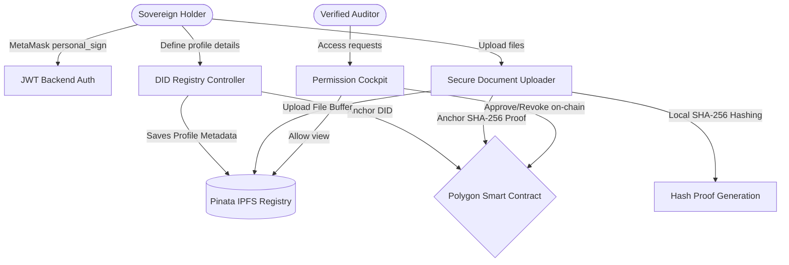

# IDChain – Decentralized Digital Identity Platform

IDChain is a state-of-the-art production-ready decentralized digital identity verification platform. It allows users to create a Decentralized Identity (DID), upload credentials (Aadhaar, Passport, Certificates) securely to IPFS, and anchor cryptographic proofs (SHA-256) on the Polygon blockchain network. The platform features dynamic permissions control so users can temporarily authorize third-party auditors (verifiers) to check their records, maintaining absolute self-sovereign control.

## 🚀 Architecture Overview



---

## 🛠 Tech Stack

### Frontend
- **Next.js 15 (App Router)** - Fast, SEO-optimized React framework.
- **Tailwind CSS** - Modern dark-theme utility-first graphics engine.
- **Ethers.js (v6)** - Client library to connect and write transactions.
- **Lucide Icons** - Reusable vector dashboard iconography.
- **Axios** - Async HTTP requests.

### Backend
- **Node.js & Express.js** - Light RESTful router gateway.
- **JWT (JsonWebTokens)** - Session authorization persistence.
- **Multer** - Dynamic binary file parsing middleware.

### Decentralized IPFS Storage
- **Pinata Cloud SDK & IPFS Gateway** - Secure, decentralized user profiles, credentials metadata, and granular activity logs pinning.

### Blockchain
- **Solidity (v0.8.20)** - Secure self-sovereign identity protocol contract.
- **Hardhat** - Core compilation, simulation, and deployment testbed.
- **OpenZeppelin Contracts** - Industry-standard secure contract blocks.

### IPFS Decentralized Storage
- **Pinata Cloud SDK** - Fast asset pinning and globally cached gateway.

---

## ⚙️ Environment Variables Config

### Blockchain Module (`contracts/.env`)
```env
PRIVATE_KEY="your_wallet_private_key"
AMOY_RPC_URL="https://rpc-amoy.polygon.technology/"
POLYGONSCAN_API_KEY="your_polygonscan_api_key"
```

### Backend Module (`backend/.env`)
```env
JWT_SECRET="generate_a_random_jwt_secret_key"
PINATA_API_KEY="your_pinata_api_key"
PINATA_SECRET_API_KEY="your_pinata_secret_api_key"
PORT=5001
```

### Frontend Module (`frontend/.env.local`)
```env
NEXT_PUBLIC_BACKEND_URL="http://localhost:5000/api"
NEXT_PUBLIC_IDENTITY_CONTRACT="0xB1C37825dD78864aA762a4CbcB04663cEfeC0370"
```

---

## 💻 Installation & Setup

### Prerequisite
- **Node.js** v18+ & **npm** Installed.
- **MetaMask Wallet** browser extension.

### Step 1: Set up Blockchain & Deploy Contract
1. Navigate to contracts workspace:
   ```bash
   cd contracts
   ```
2. Install Hardhat and OpenZeppelin modules:
   ```bash
   npm install
   ```
3. Set up variables inside `.env`.
4. Deploy the Identity registration contract to Polygon Amoy Testnet:
   ```bash
   npx hardhat run scripts/deploy.js --network amoy
   ```
5. Copy the deployed contract address output and paste it into the frontend's `.env.local` as `NEXT_PUBLIC_IDENTITY_CONTRACT`.

### Step 2: Set up Backend Service
1. Navigate to backend workspace:
   ```bash
   cd ../backend
   ```
2. Install Express and Pinata SDK dependencies:
   ```bash
   npm install
   ```
3. Set up the `.env` file with your JWT Secret and Pinata Credentials.
4. Launch the dev API service:
   ```bash
   npm run dev
   ```
   *The backend server boots at `http://localhost:5001`.*

### Step 3: Run Frontend Web Interface
1. Navigate to frontend workspace:
   ```bash
   cd ../frontend
   ```
2. Install client dependencies:
   ```bash
   npm install
   ```
3. Start the Next.js development server:
   ```bash
   npm run dev
   ```
4. Open your browser and navigate to: `http://localhost:3050` or whichever port Next.js starts on.

---

## 🛡 Security & Advanced Core Concepts
- **Nonce-based Personal Sign Auth:** IDChain guards session hijackers. Nonces are dynamically randomized on every MetaMask signature validation.
- **On-chain Anchor Signatures:** User credentials (passports/certificates) are converted to SHA-256 hash digests *locally in browser buffer*, which are permanently anchored on Polygon blockchain.
- **Zero-knowledge Proofs (ZKP) Placeholder:** Ready endpoints for ZK computation so holders can verify their age eligibility (e.g. `isAgeOver18`) without revealing their exact DOB.
- **AI Layout Prechecks:** Platform features pattern recognition filters designed to detect image manipulations in scanned PDFs and PAN layouts before saving.

---

## ✨ Future Roadmaps
1. **ZKP implementation with SnarkJS:** Fully functioning zero-knowledge verification for credential properties.
2. **ERC-721 Identity Badges:** Deploying soul-bound NFT tokens directly after complete profile validations.
3. **Cross-chain DID verification:** Verify DIDs across Arbitrum and Optimism networks.
